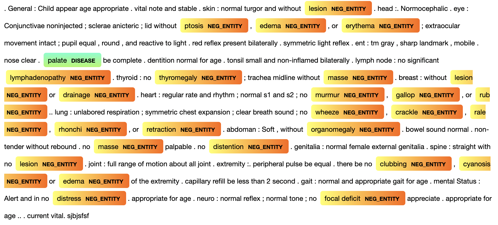

# Duke OIT: Clinical Notes Extraction and Evaluation

In accordance to HIPPA regulations with regards to the sensitive nature of our client's data, **all data stored in this repository is fake and generated with an algorithm.**

## Goal
This project aims to make use of Natural Language Processing techniques to take Electronic Health Records (EHR) and translate them into a set of features fit for prediction in order to more efficiently and more accurately track the progress of medical students.

The formal write-up containing more details about our methodologies can be found in the file titled `Capstone_DukeOIT_Final_Paper.pdf`. The slides titled `Symposium_Capstone_DukeOIT.pptx` includes detailed visualizations of our pipeline and examples of our results. 

## Introduction 

We created a generator (`code/fake_notes_generator.ipynb`) that produces notes that are free of sensitive information, yet maintain proper clinical note structure to demonstrate the code found in this repository.

Our code will proceed in the following pipeline: 
1. Note generating
2. Note type assignment
3. Note separation and detection
4. Entity recognition
5. System tagging
The result of each step will be included in the `data` directory. The details for each directory in this repository is presented in the following sections. 

## Description & Instruction
### Data:    
 The data files in this repository contains the generated results from each code file. 

### Code:
To reproduce the results generated by the code files, follow the steps below. The results for each step are stored accordingly in the data directory. 

1.  `fake_notes_generator.ipynb`
        This file generates a csv of fake notes to run the rest of the code on, complete with all of the same columns we had in our real data. A version of this notebook's output can be found in the `data` directory.
        
         Output file: fake_notes.csv
2.  `note_typing.ipynb`
        This file takes in the `fake_notes.csv` and condenses three features: "admission_service", "title" and "specialty" into one, called  "type".

         Output file: fake_notes_labeled.csv
3. `soap_extract.ipynb`
        This file includes code utilized to preprocess our data set which is consists of three parts. The first part is to filter out the notes not following the standard format of clinical notes, SOAP (Subjective, Objective, Assessment, Plan) structure. The second part is to detect each components' keywords and locate each component. The last part is to separate text based on the keywords. Additionally, we extracted “diagnosis codes” (i.e.patient problems marked by pound symbols) out of the plan component. After the separation, the data set is composed by note text, type, subjective, objective, assessment, plan, and diagnosis codes.

        Output file: fake_notes_extracted.csv
4. `objective_extract.ipynb`
        This file is utilized for further separation of objective part. To prepare for entity recognition, “Physical Exam Constitutional" (PEC) section which contains detailed summary of the relevant patient’s symptoms is separated from the objective part.

        Output file: notes_extracted_obj.csv
5. `detection_model_visualization.ipynb`
        The code in this file includes a NLP model performed Named Entity Recognition (NER) task that will detect the location of the symptoms and handle the negation of symptoms in the notes. The final product of this model was a visualization showing the keywords it detects. The following figure shows the result. 
  
6. `System Tagging`

## Results
After filtering out the notes without a SOAP structure, we are left with 69.34% of the total medical notes. Upon completion of the aforementioned steps 2 and 3, we obtained a SOAP extraction rate of 88.11%. A breakdown of the detection rate is shown in the table below. 

| Component  | Percentage |
|--------|----------|
| Subjective  | 97.0%        |
| Objective | 93.2%       |
| Assessment | 91.7% |
| Plan | 95.2% |

We then further separated the Objective component to prepare for entity recognition and extracted Physical Exam Constitutional (PEC) and diagnosis codes. The extraction rate is shown in the table below. 

 | Component  | Percentage |
|--------|----------|
| Physical Exam Constitutional   | 94.5%        |
| Diagnosis Code | 52.4%       |

We conducted entity detection on the PEC section to extract medical terminology and handle the negated entities. An example of visualization for our detection model is shown in the forward section. Finally, we converted the list of extracted entities into an indicator table and applied feature engineering and system tagging on the list to prepare for future modeling and prediction.

