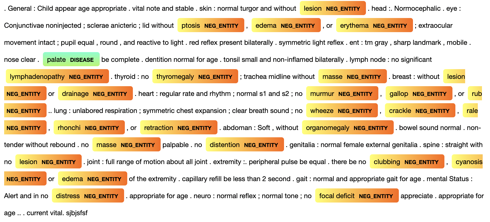

# DukeOIT-clinical-notes
Since the original data contains sensitive information about patients' medicial records, ALL DATA IN THIS REPOSITORY IS FAKE.

## Goal
This project aims to make use of Natural Language Processing techniques to take Electronic Health Records and translate them into a set of features fit for prediction in order to more efficiently and more accurately track the progress of medical students.

The formal write-up containing more details about our methodology can be found in the file titled `Capstone_DukeOIT_Final_Paper.pdf`. The slides titled `Symposium_Capstone_DukeOIT.pptx` includes detailed visualization about our pipeline and example of our result. 

## Roadmap

### A. Data:    
We made a generator (`code/fake_notes_generator.ipynb`) to create notes that are free of sensitive information, yet maintain proper clinical note structure so the code found in this repository can be demonstrated

### B. Code:
The code files in this repository can be ran by the following step. The results for each step are stored in data directory.  

1.  `fake_notes_generator.ipynb`
        This file generates a csv of fake notes to run the rest of the code on, complete with all of the same columns we had in our real data. A version of this notebook's output can be found in the `data` directory.
        
         Output file: fake_notes.csv
2.  `note_typing.ipynb`
        This file takes in the `fake_notes.csv` and condenses three features: "admission_service", "title" and "specialty" into one, called  "type".

         Output file: fake_notes_labeled.csv
3. `soap_extract.ipynb`
        This file includes code utilized to preprocess our data set which is consists of three parts. The first part is to filter out the notes not following the standard format of clinical notes, SOAP (Subjective, Objective, Assessment, Plan) structure. The second part is to detect each components' keywords and locate each component. The last part is to separate text based on the keywords. Additionally, we extracted “diagnosis codes” (i.e.patient problems marked by pound symbols) out of the plan component. After the separation, the data set is composed by note text, type, subjective, objective, assessment, plan, and diagnosis codes.

        Output file: fake_notes_extracted.csv
4. `objective_extract.ipynb`
        This file is utilized for further separation of objective part. To prepare for entity recognition, “Physical Exam Constitutionaln" (PEC) section which contains detailed summary of the relevant patient’s symptoms is separated from the objective part.

        Output file: notes_extracted_obj.csv
5. `detection_model_visualization.ipynb`
        The code in this file includes a NLP model performed Named Entity Recognition (NER) task that will detect the location of the symptoms and handle the negation of symptoms in the notes. The final product of this model was a visualization showing the keywords it detects. 

        Output file: 

